# SereneCare - Hospital Management System

A comprehensive web-based Hospital Management System designed to streamline healthcare operations and improve patient care efficiency.

## 🏥 Overview

SereneCare is a modern hospital management solution that digitalizes and automates various hospital operations including patient management, appointment scheduling, medical records, billing, and administrative tasks. The system is designed to enhance operational efficiency while maintaining high standards of patient care.

## 📸 Screenshots

### Landing Page & Dashboard
<div align="center">
  
  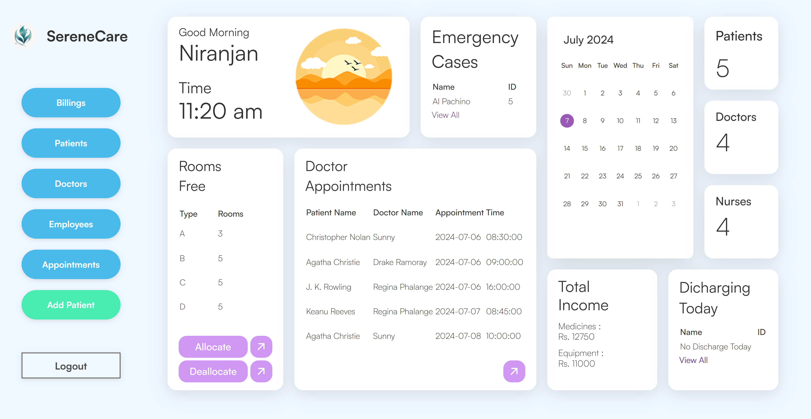
</div>

### Patient Management
<div align="center">
  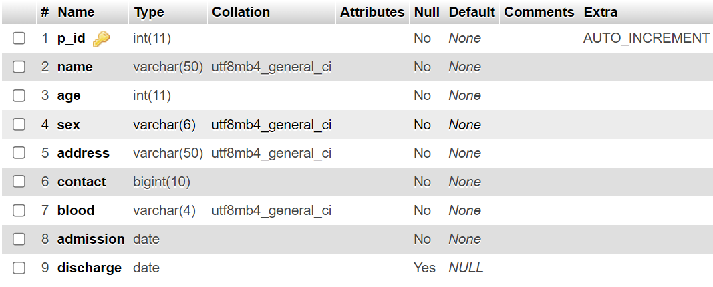
  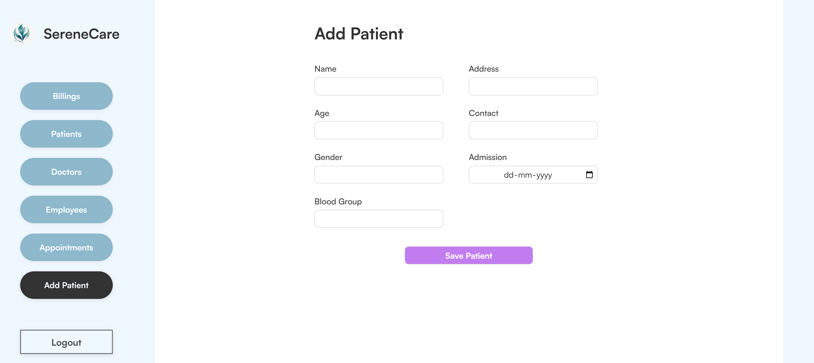
  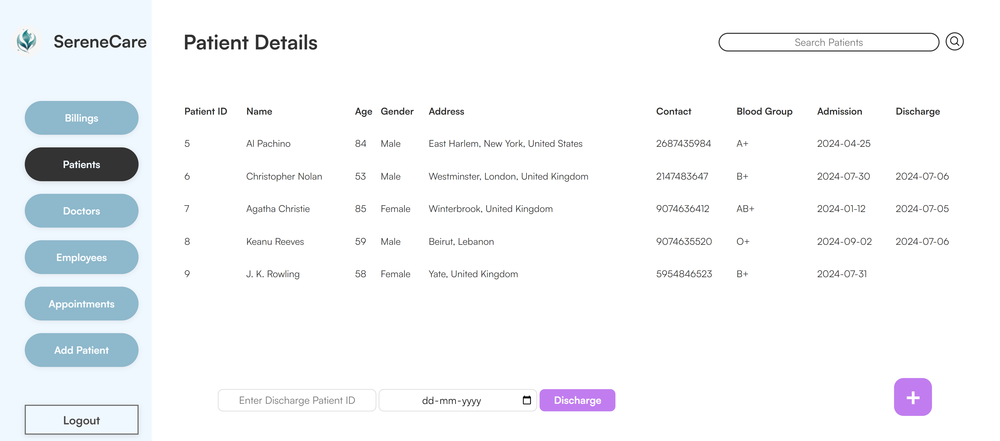
</div>

### Appointment Management
<div align="center">
  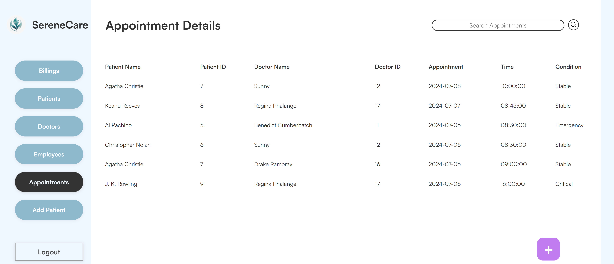
  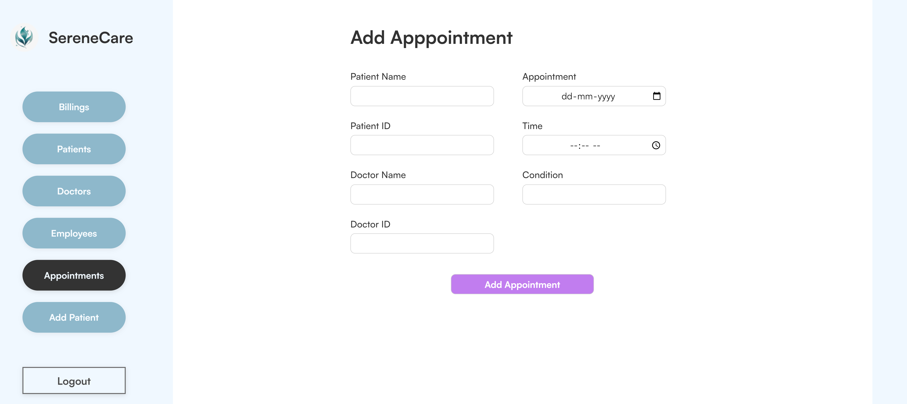
</div>

### Billing System
<div align="center">
  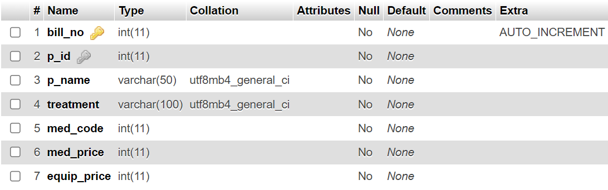
  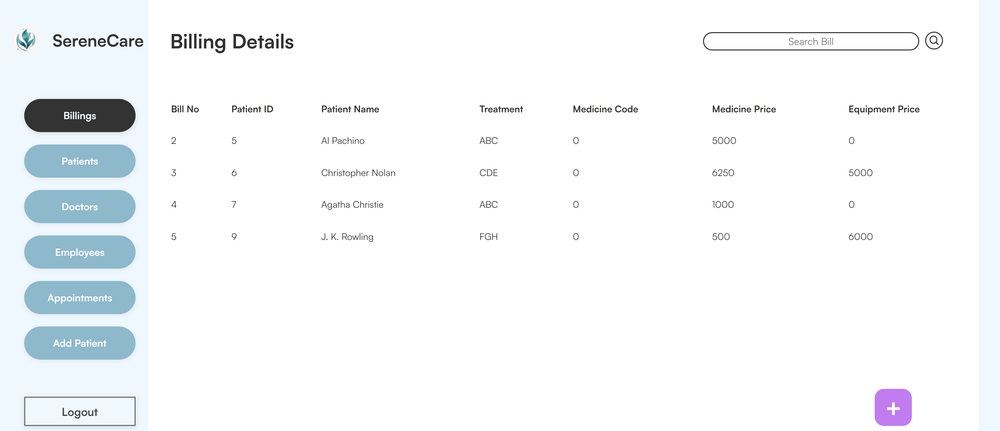
  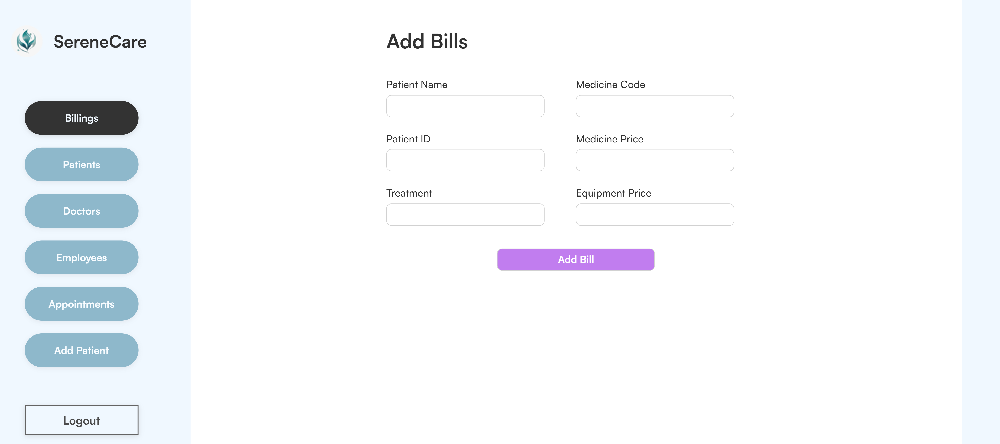
</div>

### Staff & Room Management
<div align="center">
  
  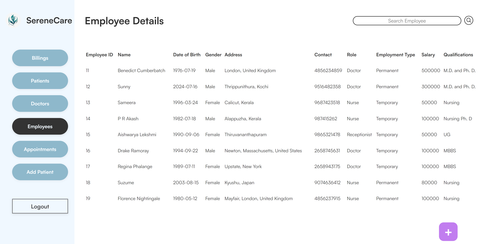
  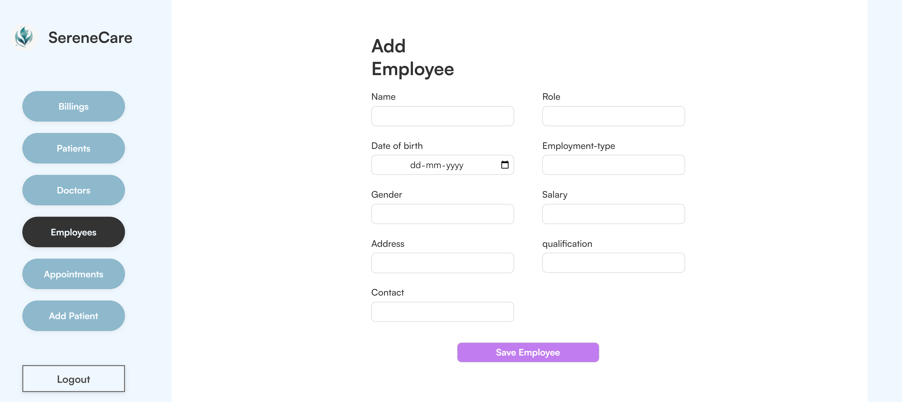
</div>

<div align="center">
  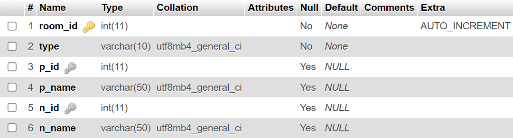
  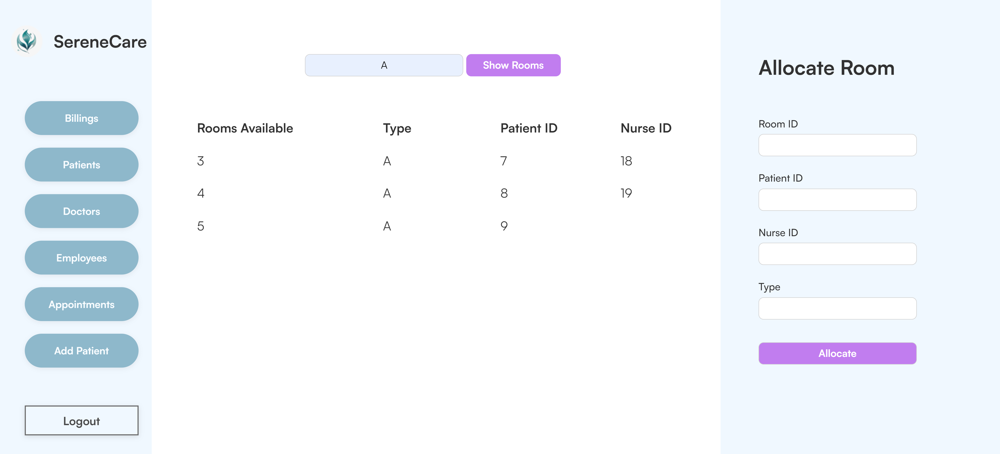
  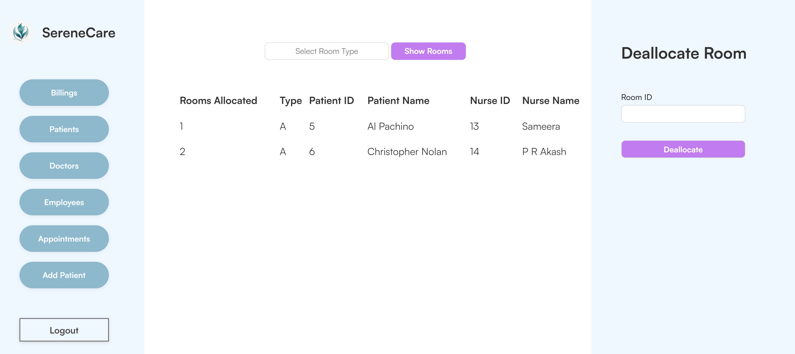
</div>

### Additional Features
<div align="center">
  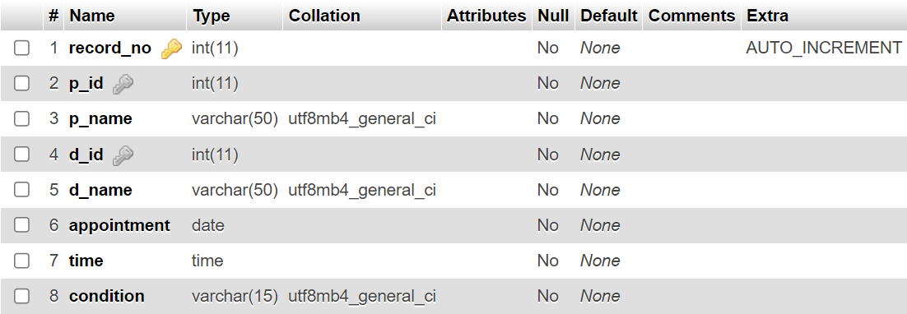
  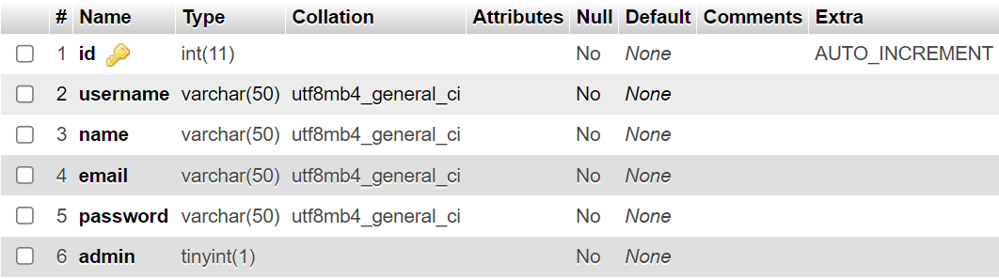
</div>

## ✨ Features

### Core Modules
- **Patient Management**: Complete patient registration, medical history, and profile management
- **Appointment Scheduling**: Automated appointment booking and management system
- **Medical Records**: Digital storage and retrieval of patient medical records
- **Billing & Finance**: Integrated billing system with payment processing
- **Staff Management**: Employee management and role-based access control
- **Room Management**: Hospital room allocation and management
- **User Management**: System user administration and access control
- **Reports & Analytics**: Comprehensive reporting and data analytics

### Key Functionalities
- 🔐 Secure user authentication and authorization
- 📱 Responsive web design for mobile and desktop
- 🔄 Real-time data synchronization
- 📊 Dashboard with key performance indicators
- 🔍 Advanced search and filtering capabilities
- 📧 Automated notifications and alerts
- 💾 Data backup and recovery systems

## 🛠️ Technology Stack

### Frontend
- **HTML5** - Structure and markup
- **CSS3** - Styling and responsive design
- **JavaScript** - Client-side functionality and interactivity
- **Bootstrap** - UI framework for responsive design

### Backend
- **PHP** - Server-side scripting language
- **MySQL** - Relational database management system

### Development Tools
- **XAMPP** - Local development environment
- **phpMyAdmin** - Database administration
- **Visual Studio Code** - Code editor

## 📋 System Requirements

### Minimum Requirements
- **Web Server**: Apache 2.4+
- **PHP**: Version 7.4 or higher
- **Database**: MySQL 5.7+ or MariaDB 10.2+
- **Memory**: 2GB RAM minimum
- **Storage**: 500MB free disk space

### Recommended Requirements
- **Web Server**: Apache 2.4+ with mod_rewrite enabled
- **PHP**: Version 8.0+
- **Database**: MySQL 8.0+
- **Memory**: 4GB RAM
- **Storage**: 2GB free disk space

## 🚀 Installation

### Prerequisites
1. Install XAMPP or similar web server package
2. Ensure PHP and MySQL are properly configured
3. Enable necessary PHP extensions (mysqli, pdo, etc.)

### Setup Instructions

1. **Clone the repository**
   ```bash
   git clone https://github.com/KenwayBlue7/SereneCare-Hospital-Management-System.git
   cd serenecare
   ```

2. **Database Setup**
   ```bash
   # Start MySQL service
   # Create a new database named 'hospital_management'
   # Import the database schema
   mysql -u root -p hospital_management < database/schema.sql
   ```

3. **Configuration**
   ```php
   // Update config/database.php with your database credentials
   $host = 'localhost';
   $username = 'your_username';
   $password = 'your_password';
   $database = 'hospital_management';
   ```

4. **File Permissions**
   ```bash
   # Set appropriate permissions for upload directories
   chmod 755 uploads/
   chmod 755 assets/
   ```

5. **Access the Application**
   - Open your web browser
   - Navigate to `http://localhost/serenecare`
   - Login with default credentials (see documentation)

## 📖 Usage

### Default Login Credentials
- **Admin**: admin@serenecare.com / admin123
- **Doctor**: doctor@serenecare.com / doctor123
- **Receptionist**: reception@serenecare.com / reception123

### Quick Start Guide
1. **Dashboard**: Access overview of hospital operations
2. **Patient Management**: Register new patients or search existing records
3. **Appointments**: Schedule and manage patient appointments
4. **Medical Records**: Add and view patient medical histories
5. **Billing**: Generate bills and process payments
6. **Room Management**: Allocate and manage hospital rooms
7. **Staff Management**: Manage employees and their roles
8. **Reports**: Generate various operational reports

## 🏗️ Project Structure

```
serenecare/
├── Screenshots/          # Application screenshots
├── assets/
│   ├── css/
│   ├── js/
│   └── images/
├── config/
│   └── database.php
├── includes/
│   ├── header.php
│   ├── footer.php
│   └── functions.php
├── modules/
│   ├── patients/
│   ├── appointments/
│   ├── billing/
│   ├── employees/
│   ├── rooms/
│   └── reports/
├── database/
│   └── schema.sql
├── uploads/
├── index.php
└── README.md
```

## 🔒 Security Features

- **Password Encryption**: Secure password hashing using PHP's password_hash()
- **SQL Injection Prevention**: Prepared statements and parameterized queries
- **XSS Protection**: Input sanitization and output encoding
- **Session Management**: Secure session handling and timeout
- **Access Control**: Role-based permissions and authentication
- **Data Validation**: Server-side input validation

## 🤝 Contributing

We welcome contributions to improve SereneCare! Please follow these steps:

1. Fork the repository
2. Create a feature branch (`git checkout -b feature/AmazingFeature`)
3. Commit your changes (`git commit -m 'Add some AmazingFeature'`)
4. Push to the branch (`git push origin feature/AmazingFeature`)
5. Open a Pull Request

### Development Guidelines
- Follow PSR-12 coding standards for PHP
- Write meaningful commit messages
- Include appropriate documentation
- Test your changes thoroughly
- Ensure responsive design compatibility

## 📄 License

This project is licensed under the MIT License - see the [LICENSE](LICENSE) file for details.

## 🆘 Support

For support and questions:
- **Email**: [niranjankj639@gmail.com](mailto:niranjankj639@gmail.com)

## 🙏 Acknowledgments

- Hospital staff who provided valuable feedback during development
- Open source community for various libraries and frameworks used
- Beta testers who helped identify and resolve issues

## 📈 Future Enhancements

- **Mobile Application**: Native mobile apps for iOS and Android
- **API Integration**: RESTful API for third-party integrations
- **Telemedicine**: Video consultation capabilities
- **AI Integration**: Predictive analytics and decision support
- **Multi-language Support**: Localization for different languages
- **Cloud Deployment**: AWS/Azure deployment options

---

**Note**: This system is designed for educational and demonstration purposes. For production use in healthcare environments, ensure compliance with relevant healthcare regulations and data protection laws (HIPAA, GDPR, etc.).
